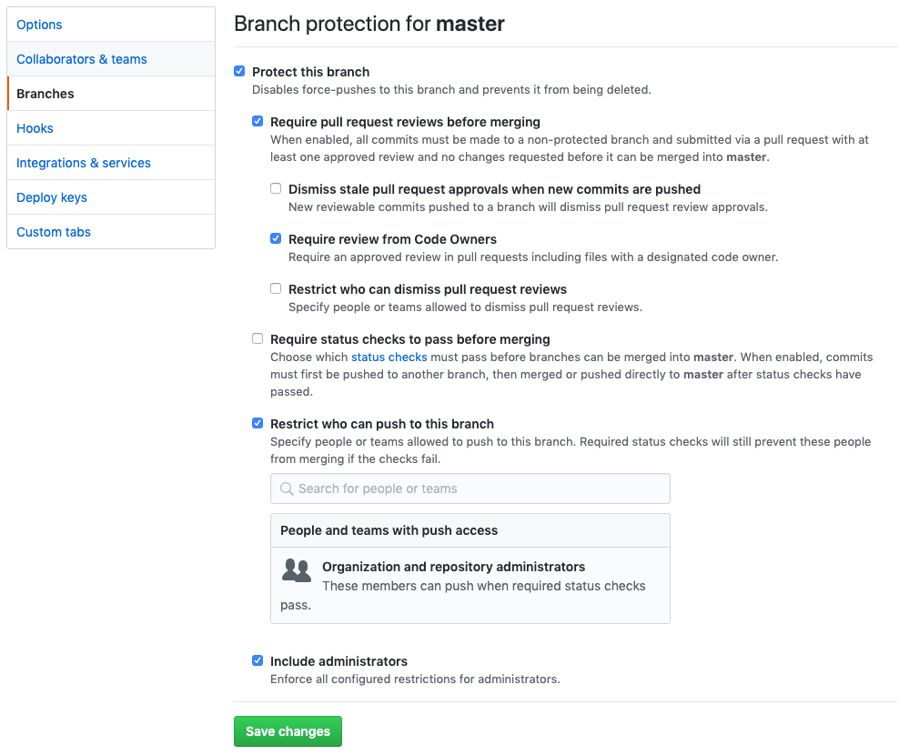

# Protected Branches 101

### Setup your first protected branch

Settings -> Branches

- Disable force pushes `git push --force`
- Disable branch deletion `git push origin --delete master`
- Require PR & review before merging
- Prevent EVERYONE from pushing directly to the protected branch



### Example #1 - pushing directly to `master` prohibited
```bash  
$ git checkout master
Switched to branch 'master'
Your branch is up to date with 'origin/master'.

$ touch FAIL.md
$ git add .
$ git commit -m 'adding commit that should fail'
[master 2b3c5d1] adding commit that should fail
 1 file changed, 0 insertions(+), 0 deletions(-)
 create mode 100644 FAIL.md

$ git push
Enumerating objects: 4, done.
Counting objects: 100% (4/4), done.
Delta compression using up to 8 threads
Compressing objects: 100% (2/2), done.
Writing objects: 100% (3/3), 275 bytes | 275.00 KiB/s, done.
Total 3 (delta 1), reused 0 (delta 0)
remote: Resolving deltas: 100% (1/1), completed with 1 local object.
remote: error: GH006: Protected branch update failed for refs/heads/master.
remote: error: At least one approved review is required by reviewers with write access.
To https://paentgit01.aaa-acg.net/ACG/git-guide.git
 ! [remote rejected] master -> master (protected branch hook declined)
error: failed to push some refs to 'https://paentgit01.aaa-acg.net/ACG/git-guide.git'

```
#### `git reset`

```bash
$ git log --oneline
2b3c5d1 (HEAD -> master) adding commit that should fail
aac7129 (origin/master) Commit initial draft for discussion with cloud engineering#
9d900c5 first commit

$ git reset aac7129

$ git log --oneline
aac7129 (HEAD -> master, origin/master) Commit initial draft for discussion with cloud engineering#
9d900c5 first commit
```

### Example #2 - deleting `master` prohibited

```bash
$ git push origin --delete master
To https://paentgit01.aaa-acg.net/ACG/git-guide.git
 ! [remote rejected] master (refusing to delete the current branch: refs/heads/master)
error: failed to push some refs to 'https://paentgit01.aaa-acg.net/ACG/git-guide.git'
```

### Example #3 - `merge` without review prohibited

```bash
$ git checkout master
Switched to branch 'master'
Your branch is up to date with 'origin/master'.

$ git merge feature/protected-branches
Updating aac7129..32cbc6d
Fast-forward
 02_protected_branches_101.md             |  61 +++++++++++++++++++++++++++++++++
 images/01_settings_branch_protection.png | Bin 0 -> 169463 bytes
 images/01_settings_merge_button.png      | Bin 0 -> 50092 bytes
 3 files changed, 61 insertions(+)
 create mode 100644 02_protected_branches_101.md
 create mode 100644 images/01_settings_branch_protection.png
 create mode 100644 images/01_settings_merge_button.png

$ git push
Total 0 (delta 0), reused 0 (delta 0)
remote: error: GH006: Protected branch update failed for refs/heads/master.
remote: error: At least one approved review is required by reviewers with write access.
To https://paentgit01.aaa-acg.net/ACG/git-guide.git
 ! [remote rejected] master -> master (protected branch hook declined)
error: failed to push some refs to 'https://paentgit01.aaa-acg.net/ACG/git-guide.git'
```
