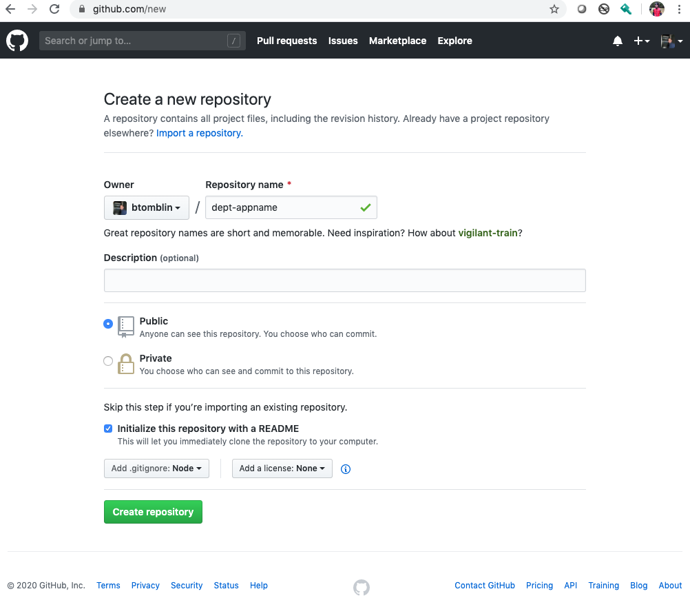
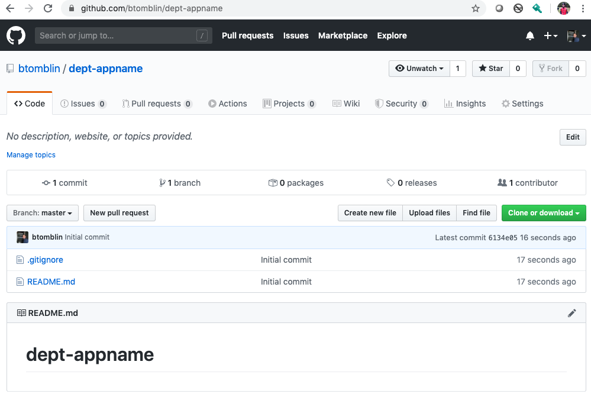
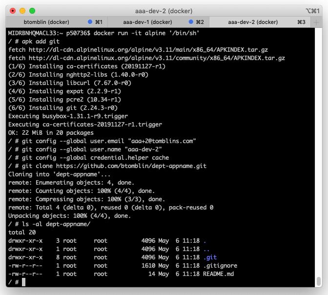

# GitHub 101

#### What is GitHub Enterprise (GHE)?
GitHub Enterprise is the on-premises version of GitHub.com

#### How is GitHub Enterprise different from GitHub.com?
GitHub Enterprise  includes the same great set of features as GitHub.com but packaged for running on your organization's local network. All repository data is stored on machines that you control, and access is integrated with your organization's authentication system (LDAP, SAML, or CAS).

### Want to learn more about git & github?

Give it a try for yourself at github.com, all skills and capabilities will translate 100% to GHE.

### Example #1

#### Create a repository



```bash
$ docker run -it alpine '/bin/sh'

/ # apk add git
fetch http://dl-cdn.alpinelinux.org/alpine/v3.11/main/x86_64/APKINDEX.tar.gz
fetch http://dl-cdn.alpinelinux.org/alpine/v3.11/community/x86_64/APKINDEX.tar.gz
(1/6) Installing ca-certificates (20191127-r1)
(2/6) Installing nghttp2-libs (1.40.0-r0)
(3/6) Installing libcurl (7.67.0-r0)
(4/6) Installing expat (2.2.9-r1)
(5/6) Installing pcre2 (10.34-r1)
(6/6) Installing git (2.24.3-r0)
Executing busybox-1.31.1-r9.trigger
Executing ca-certificates-20191127-r1.trigger
OK: 22 MiB in 20 packages

/ # git config --global user.email "ben@tomblins.com"
/ # git config --global user.name "btomblin"
/ # git config --global credential.helper cache

/ # git clone https://github.com/btomblin/dept-appname.git
Cloning into 'dept-appname'...
remote: Enumerating objects: 4, done.
remote: Counting objects: 100% (4/4), done.
remote: Compressing objects: 100% (3/3), done.
remote: Total 4 (delta 0), reused 0 (delta 0), pack-reused 0
Unpacking objects: 100% (4/4), done.

/ # cd dept-appname/
/dept-appname # ls -al
total 20
drwxr-xr-x    3 root     root          4096 May  6 10:40 .
drwxr-xr-x    1 root     root          4096 May  6 10:40 ..
drwxr-xr-x    8 root     root          4096 May  6 10:40 .git
-rw-r--r--    1 root     root          1610 May  6 10:40 .gitignore
-rw-r--r--    1 root     root            14 May  6 10:40 README.md
```



### Example #2 - (3) naïve developers working on the same project

**GitHub Accounts:** btomblin, aaa-dev-1, aaa-dev-2  
**Alpine Docker Container:** `docker pull alpine`



#### All 3 developers starting out, same code base locally & remote
```
~/btomblin/dept-appname # ls -al
total 20
drwxr-xr-x    3 root     root          4096 May  6 11:58 .
drwxr-xr-x    3 root     root          4096 May  6 11:58 ..
drwxr-xr-x    8 root     root          4096 May  6 11:58 .git
-rw-r--r--    1 root     root          1610 May  6 11:58 .gitignore
-rw-r--r--    1 root     root            14 May  6 11:58 README.md
```

```
~/aaa-dev-1/dept-appname # ls -al
total 20
drwxr-xr-x    3 root     root          4096 May  6 11:58 .
drwxr-xr-x    3 root     root          4096 May  6 11:58 ..
drwxr-xr-x    8 root     root          4096 May  6 11:58 .git
-rw-r--r--    1 root     root          1610 May  6 11:58 .gitignore
-rw-r--r--    1 root     root            14 May  6 11:58 README.md
```

```
~/aaa-dev-2/dept-appname # ls -al
total 20
drwxr-xr-x    3 root     root          4096 May  6 11:58 .
drwxr-xr-x    3 root     root          4096 May  6 11:58 ..
drwxr-xr-x    8 root     root          4096 May  6 11:58 .git
-rw-r--r--    1 root     root          1610 May  6 11:58 .gitignore
-rw-r--r--    1 root     root            14 May  6 11:58 README.md
```

#### Contributor `btomblin` makes his first commit

```javascript
/btomblin/dept-appname # git diff

diff --git a/README.md b/README.md
index 7144db3..6b48e37 100644
--- a/README.md
+++ b/README.md
@@ -1 +1,3 @@
-# dept-appname
\ No newline at end of file
+# dept-appname
+
+my update is the best

~/btomblin/dept-appname # git commit -am 'update stuff'
[master 5ac256d] update stuff
 1 file changed, 3 insertions(+), 1 deletion(-)

~/btomblin/dept-appname # git push
Enumerating objects: 5, done.
Counting objects: 100% (5/5), done.
Delta compression using up to 4 threads
Compressing objects: 100% (2/2), done.
Writing objects: 100% (3/3), 313 bytes | 313.00 KiB/s, done.
Total 3 (delta 0), reused 0 (delta 0)
To https://github.com/btomblin/dept-appname.git
   6134e05..5ac256d  master -> master
```

#### Next `aaa-dev-1` and `aaa-dev-2` want to contribute

Each make their own unique changes to the same file and futilely attempt to push. 

Developer 1 assumes their the center of the universe and just goes for it `git push`

```javascript
~/aaa-dev-1/dept-appname # git commit -am 'update README.md'
~/aaa-dev-1/dept-appname # git push
To https://github.com/btomblin/dept-appname.git
 ! [rejected]        master -> master (fetch first)
error: failed to push some refs to 'https://github.com/btomblin/dept-appname.git'
hint: Updates were rejected because the remote contains work that you do
hint: not have locally. This is usually caused by another repository pushing
hint: to the same ref. You may want to first integrate the remote changes
hint: (e.g., 'git pull ...') before pushing again.
hint: See the 'Note about fast-forwards' in 'git push --help' for details.
```

Developer 2, marginally more intelligent, decides to check for changes on the remote first
```javascript
~/aaa-dev-2/dept-appname # git pull
remote: Enumerating objects: 5, done.
remote: Counting objects: 100% (5/5), done.
remote: Compressing objects: 100% (2/2), done.
remote: Total 3 (delta 0), reused 3 (delta 0), pack-reused 0
Unpacking objects: 100% (3/3), done.
From https://github.com/btomblin/dept-appname
   6134e05..5ac256d  master     -> origin/master
Auto-merging README.md
CONFLICT (content): Merge conflict in README.md
Automatic merge failed; fix conflicts and then commit the result.
~/aaa-dev-2/dept-appname # cat README.md
# dept-appname

<<<<<<< HEAD
I'd like to update this file
=======
my update is the best
>>>>>>> 5ac256dd6483c83fbad0cbfdb26954b002fcf382
```

Developer 1, frustrated, starts to google for answers and learns the flag `--force`

```js
~/aaa-dev-1/dept-appname # git push --force
Enumerating objects: 7, done.
Counting objects: 100% (7/7), done.
Delta compression using up to 4 threads
Compressing objects: 100% (5/5), done.
Writing objects: 100% (7/7), 1.67 KiB | 569.00 KiB/s, done.
Total 7 (delta 0), reused 0 (delta 0)
To https://github.com/btomblin/dept-appname.git
 + 5ac256d...25b4fab master -> master (forced update)
 ```

 Developer 2, also starts to google for answers and comes across [Resolving a merge conflict using the command line](https://help.github.com/en/github/collaborating-with-issues-and-pull-requests/resolving-a-merge-conflict-using-the-command-line)

 ```js
 ~/aaa-dev-2/dept-appname # cat README.md
# dept-appname

<<<<<<< HEAD
I'd like to update this file
=======
my update is the best
>>>>>>> 5ac256dd6483c83fbad0cbfdb26954b002fcf382

~/aaa-dev-2/dept-appname # vi README.md <-resolves changes

~/aaa-dev-2/dept-appname # git add .
~/aaa-dev-2/dept-appname # git commit -m "Resolved merge conflict by incorporating both suggestions."
[master 247e9f2] Resolved merge conflict by incorporating both suggestions.

~/aaa-dev-2/dept-appname # git push
Enumerating objects: 16, done.
Counting objects: 100% (16/16), done.
Delta compression using up to 4 threads
Compressing objects: 100% (10/10), done.
Writing objects: 100% (12/12), 1.28 KiB | 217.00 KiB/s, done.
Total 12 (delta 1), reused 0 (delta 0)
remote: Resolving deltas: 100% (1/1), done.
To https://github.com/btomblin/dept-appname.git
   25b4fab..247e9f2  master -> master
 ```

 ### Let the blame game begin

 ```btomblin``` where'd my change go? It's missing and there is no record of it, GIT is terrible

 ```aaa-dev-1``` GIT is pretty cool, --force makes it super easy to fix all my problems

 ```aaa-dev-2``` Ugh, why can't we go back to SVN, we didn't have all these confusing problems to deal with, not sure what `btomblin` did wrong, my changes made it, he's probably just a liar

### So what went wrong?

None of these 3 stooges bothered to understand the fundamentals of GIT

- No branching strategy was defined upfront, working straight from ```master``` only works if your the sole contributor to a project
- Nobody bothered to make `master` a **protected** branch, you should never be able to contribute directly to or force push to `master`
- The list goes on & on, this example was an attempt at humor, not a how-to guide

 :warning: **Please understand the GIT basics before continuing**: This is not a beginners guide! :warning:

 :heavy_exclamation_mark: If you have not made, gracefully recovered from these mistakes, and learned from the experience please do so before continuing...you have been warned! :heavy_exclamation_mark: